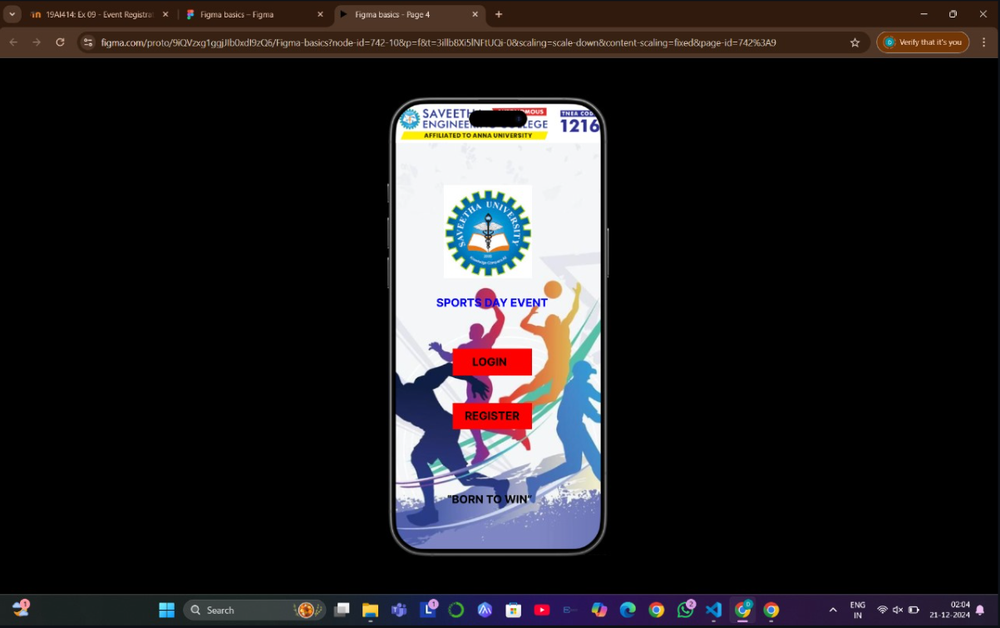
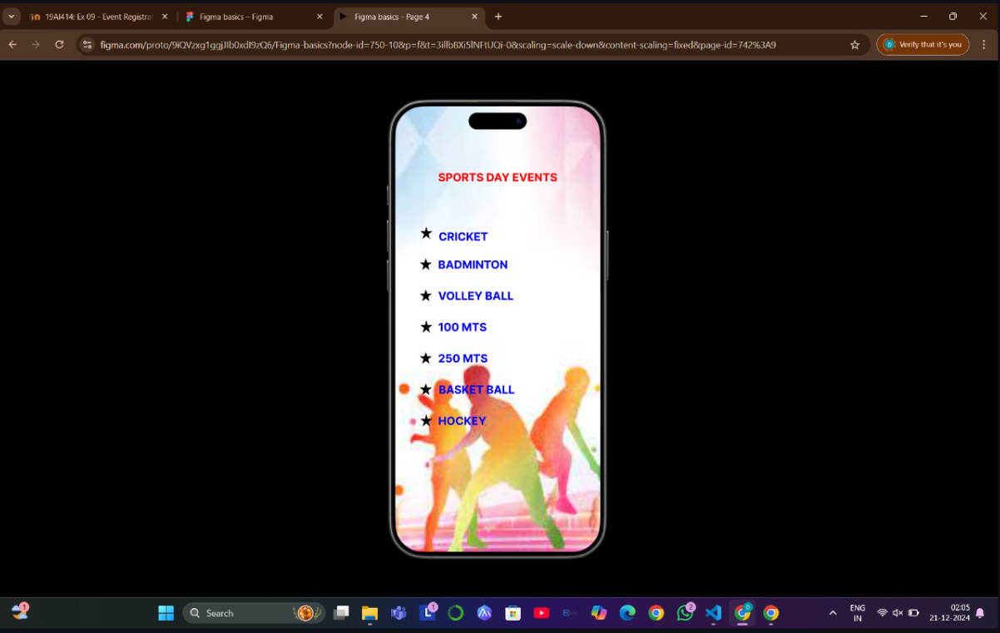
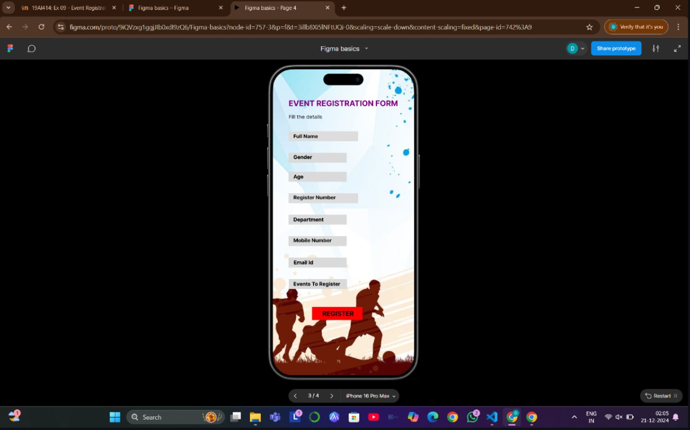
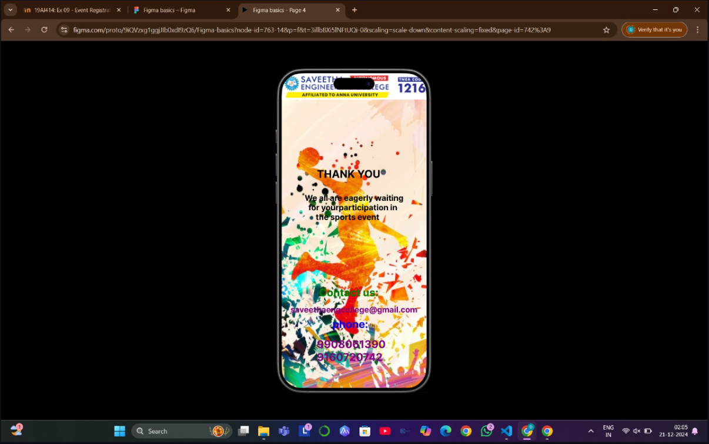

# Ex09 Event Registration Web Application
## Date:16-11-2025

## AIM:
To design, develop and deploy a web application for event registration.

## DESIGN STEPS:

### Step 1:
Create a new frame.

### Step 2:
Select any one preset size of your choice.

### Step 3:
Select the shapes you need.

### Step 4:
Import images as needed.

### Step 5:
Create pages based on your need and link them.

### Step 6:

Validate the HTML and CSS code.

### Step 6:

Publish the website in the given URL.

## DESIGN TOOL:
Figma

## CODE:
```
<!DOCTYPE html>
<html lang="en">
<head>
  <meta charset="UTF-8">
  <meta name="viewport" content="width=device-width, initial-scale=1.0">
  <title>Sports Day Event</title>
  <style>
    body {
      margin: 0;
      padding: 0;
      font-family: Arial, sans-serif;
      background-color: white;
      display: flex;
      justify-content: center;
      align-items: center;
      height: 100vh;
    }
    .container {
      width: 375px;
      background: #fff;
      border-radius: 20px;
      overflow: hidden;
      box-shadow: 0 6px 8px rgba(0, 0, 0, 0.3);
    }
    .header {
      background: #ffc107;
      text-align: center;
      padding: 10px 0;
    }
    .header img {
      height: 70px;
    }
    .content {
      padding: 80px;
      text-align: center;
      background-image: url('background.png');
      background-size: cover;
      background-position: center;
    }
    .content h1 {
      color: #0056b3;
      font-size: 1.5em;
      margin-bottom: 20px;
    }
    .button {
      display: block;
      width: 100%;
      padding: 10px;
      margin: 10px 0;
      color: #fff;
      background: #ff0000;
      border: none;
      border-radius: 5px;
      font-size: 1em;
      cursor: pointer;
    }
    .button:hover {
      background: #cc0000;
    }
    .footer {
      margin-top: 20px;
      color: #000;
      font-size: 0.9em;
    }
  </style>
</head>
<body>
  <div class="container">
    <div class="header">
       <!-- Replace with your logo -->
    </div>
    <div class="content">
       <!-- Replace with your image -->
      <h3 fontcolor="blue">SPORTS DAY EVENT</h3>
      <button class="button">LOGIN</button>
      <button class="button">REGISTER</button>
    </div>
    <div class="footer" align="center">"BORN TO WIN"</div>
  </div>
</body>
</html>

Event Page

<!DOCTYPE html>
<html lang="en">
<head>
  <meta charset="UTF-8">
  <meta name="viewport" content="width=device-width, initial-scale=1.0">
  <title>Sports Day Events</title>
  <style>
    body {
      margin: 0;
      padding: 0;
      font-family: Arial, sans-serif;
      background-color: #000;
      display: flex;
      justify-content: center;
      align-items: center;
      height: 100vh;
    }
    .container {
      width: 375px;
      background: #fff;
      border-radius: 20px;
      overflow: hidden;
      box-shadow: 0 4px 6px rgba(0, 0, 0, 0.3);
    }
    .header {
      text-align: center;
      background: linear-gradient(135deg, #f8c471, #f5b7b1);
      color: #ff0000;
      font-weight: bold;
      font-size: 1.5em;
      padding: 20px;
    }
    .content {
      padding: 150px;
      background-image: url('bakgr.png');
      background-size: cover;
      background-position: center;
    }
    .content ul {
      list-style: none;
      padding: 0;
    }
    .content li {
      color: #0000ff;
      font-size: 1.2em;
      margin: 10px 0;
      display: flex;
      align-items: center;
    }
    .content li::before {
      content: "★";
      color: #000;
      margin-right: 10px;
    }
  </style>
</head>
<body>
  <div class="container">
    <div class="header">SPORTS DAY EVENTS</div>
    <div class="content">
      <ul>
        <li>CRICKET</li>
        <li>BADMINTON</li>
        <li>VOLLEYBALL</li>
        <li>100 MTS</li>
        <li>250 MTS</li>
        <li>BASKETBALL</li>
        <li>HOCKEY</li>
      </ul>
    </div>
  </div>
</body>
</html>

Event Registration

<!DOCTYPE html>
<html lang="en">
<head>
  <meta charset="UTF-8">
  <meta name="viewport" content="width=device-width, initial-scale=1.0">
  <title>Event Registration Form</title>
  <style>
    body {
      margin: 0;
      padding: 0;
      font-family: Arial, sans-serif;
      background-color: #000;
      display: flex;
      justify-content: center;
      align-items: center;
      height: 200vh;
    }
    .container {
      width: 375px;
      background: #fff;
      border-radius: 20px;
      overflow: hidden;
      box-shadow: 0 4px 6px rgba(0, 0, 0, 0.3);
    }
    .header {
      text-align: center;
      font-size: 1.5em;
      color: #800080;
      font-weight: bold;
      padding: 20px;
    }
    .subheader {
      text-align: center;
      font-size: 1em;
      color: #555;
      margin-bottom: 20px;
    }
    .form-container {
      padding: 20px;
      background-image: url('backgr2.png'); /* Replace with your image */
      background-size: cover;
      background-position: center;
    }
    .form-group {
      margin-bottom: 15px;
    }
    .form-group label {
      display: block;
      font-size: 0.9em;
      color: #000;
      margin-bottom: 5px;
    }
    .form-group input {
      width: 100%;
      padding: 10px;
      font-size: 1em;
      border: 1px solid #ccc;
      border-radius: 5px;
      outline: none;
    }
    .form-group input:focus {
      border-color: #007bff;
    }
    .register-button {
      width: 100%;
      padding: 10px;
      font-size: 1em;
      background: #ff0000;
      color: #fff;
      border: none;
      border-radius: 5px;
      cursor: pointer;
    }
    .register-button:hover {
      background: #cc0000;
    }
  </style>
</head>
<body>
  <div class="container">
    <div class="header">EVENT REGISTRATION FORM</div>
    <div class="subheader">Fill the details</div>
    <div class="form-container">
      <form>
        <div class="form-group">
          <label for="full-name">Full Name</label>
          <input type="text" id="full-name" name="full-name" placeholder="Enter your full name" required>
        </div>
        <div class="form-group">
          <label for="gender">Gender</label>
          <input type="text" id="gender" name="gender" placeholder="Enter your gender" required>
        </div>
        <div class="form-group">
          <label for="age">Age</label>
          <input type="number" id="age" name="age" placeholder="Enter your age" required>
        </div>
        <div class="form-group">
          <label for="register-number">Register Number</label>
          <input type="text" id="register-number" name="register-number" placeholder="Enter your register number" required>
        </div>
        <div class="form-group">
          <label for="department">Department</label>
          <input type="text" id="department" name="department" placeholder="Enter your department" required>
        </div>
        <div class="form-group">
          <label for="mobile-number">Mobile Number</label>
          <input type="tel" id="mobile-number" name="mobile-number" placeholder="Enter your mobile number" required>
        </div>
        <div class="form-group">
          <label for="email">Email ID</label>
          <input type="email" id="email" name="email" placeholder="Enter your email" required>
        </div>
        <div class="form-group">
          <label for="events">Events To Register</label>
          <input type="text" id="events" name="events" placeholder="Enter the events" required>
        </div>
        <button type="submit" class="register-button">REGISTER</button>
      </form>
    </div>
  </div>
</body>
</html>

Contact Page

<!DOCTYPE html>
<html lang="en">
<head>
    <meta charset="UTF-8">
    <meta name="viewport" content="width=device-width, initial-scale=1.0">
    <title>Sports Event Invitation</title>
    <style>
        body {
            margin: 0;
            font-family: Arial, sans-serif;
            background-color: #f4f4f4;
            background-image: url('Screenshot 2024-12-21 001544.png'); /* Replace with the appropriate image URL */
            background-size: cover;
            background-position: center;
        }
        .container {
            text-align: center;
            padding: 10px;
            color: #fff;
        }
        h1 {
            font-size: 2rem;
            margin-bottom: 10px;
        }
        p {
            font-size: 1rem;
            margin-bottom: 20px;
        }
        .contact-info {
            margin-top: 20px;
        }
        .contact-info a {
            display: block;
            color: #ffeb3b;
            text-decoration: none;
            margin-bottom: 10px;
        }
        .contact-info a:hover {
            text-decoration: underline;
        }
    </style>
</head>
<body>
    <div class="container">
         <!-- Replace with the logo URL -->
        <h1>Thank You</h1>
        <p>We are eagerly waiting for your participation in the sports event</p>
        <div class="contact-info">
            <p>Contact us:</p>
            <a href="mailto:saveetheargcollege@gmail.com">saveetheargcollege@gmail.com</a>
            <a href="tel:+91908061390">+91 908061390</a>
            <a href="tel:+919160729742">+91 9160729742</a>
        </div>
    </div>
</body>
</html>

```

## OUTPUT:





## RESULT:
The program to design, develop and deploy a web application for event registration is completed successfully.
